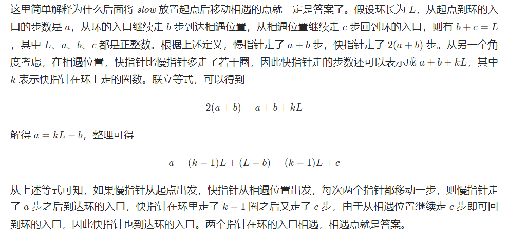

#### 二分，定义$$ cnt[i] $$表示$$ nums $$数组中小于等于$$ i $$的数有多少个，假设我们重复的数是$$ target $$，那么$$ [1, target - 1] $$里的所有数满足$$ cnt[i] \leqslant i $$，$$ [target, n] $$里的所有数满足$$ cnt[i] > i $$，具有单调性

#### 以示例1为例，

| nums | 1    | 2    | 3    | 4    |
| ---- | ---- | ---- | ---- | ---- |
| cnt  | 1    | 3    | 4    | 5    |

```c++
class Solution {
public:
    int findDuplicate(vector<int>& nums) {
        int n = nums.size();
        int l = 1, r = n - 1, ans = -1;
        while (l <= r) {
            int mid = (l + r) >> 1;
            int cnt = 0;
            for (int i = 0; i < n; ++i) {
                cnt += nums[i] <= mid;
            }
            if (cnt <= mid) {
                l = mid + 1;
            } else {
                r = mid - 1;
                ans = mid;
            }
        }
        return ans;
    }
};
```

#### 时间复杂度：$$ O(logn) $$ 

#### 空间复杂度：$$ O(1) $$


#### 二进制，将所有数二进制展开按位考虑如何找出重复的数，考虑到第$$ i $$位，我们记$$ nums $$数组中二进制展开后第$$ i $$位为$$ 1 $$的数有$$ x $$个，数字$$ [1,n] $$这$$ n $$个数二进制展开后第$$ i $$位为$$ 1 $$的数有$$ y $$个，那么重复的数第$$ i $$位为$$ 1 $$当且仅当$$ x \gt y $$

```c++
class Solution {
public:
    int findDuplicate(vector<int>& nums) {
        int n = nums.size(), ans = 0;
        // 确定二进制下最高位是多少
        int bit_max = 31;
        while (!((n - 1) >> bit_max)) {
            bit_max -= 1;
        }
        for (int bit = 0; bit <= bit_max; ++bit) {
            int x = 0, y = 0;
            for (int i = 0; i < n; ++i) {
                if (nums[i] & (1 << bit)) {
                    x += 1;
                }
                if (i >= 1 && (i & (1 << bit))) {
                    y += 1;
                }
            }
            if (x > y) {
                ans |= 1 << bit;
            }
        }
        return ans;
    }
};
```

#### 时间复杂度：$$ O(nlogn) $$ 

#### 空间复杂度：$$ O(1) $$


#### 快慢指针，利用Floyd判圈算法

#### 我们对$$ nums $$数组建图，每个位置$$ i $$连一条$$ i \rightarrow nums[i] $$的边。由于存在重复的数字$$ target $$，因此$$ target $$这个位置一定有起码两条指向它的边，一定存在环。

#### 我们先设置慢指针$$ slow $$和快指针$$ fast $$，慢指针每次走一步，快指针每次走两步，根据「Floyd 判圈算法」两个指针在有环的情况下一定会相遇，此时我们再将$$ slow $$放置起点0，两个指针每次同时移动一步，相遇的点就是答案。

```c++
class Solution {
public:
    int findDuplicate(vector<int>& nums) {
        int slow = 0, fast = 0;
        do {
            slow = nums[slow];
            fast = nums[nums[fast]];
        } while (slow != fast);
        slow = 0;
        while (slow != fast) {
            slow = nums[slow];
            fast = nums[fast];
        }
        return slow;
    }
};
```

#### 时间复杂度：$$ O(n) $$ 

#### 空间复杂度：$$ O(1) $$



