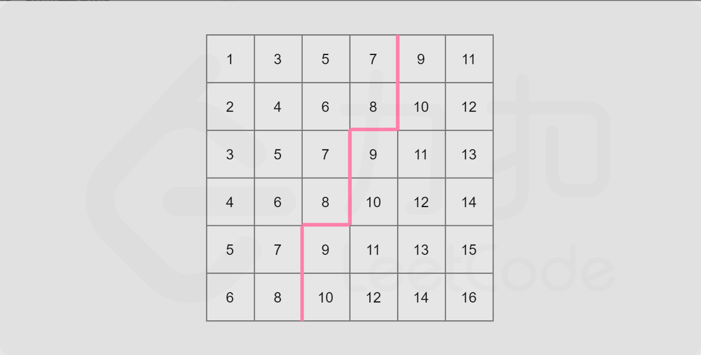

#### 拉成一维数组后直接暴力可以解决


#### 归并排序，在整个矩阵中，每次弹出矩阵中的最小值，第$$ k $$个被弹出的就是我们需要的数字

#### 本质上是保证候选人列表中每一个数字是每一行的最小值

```c++
class Solution {
public:
    typedef pair<int, pair<int, int>> PIP;

    int kthSmallest(vector<vector<int>>& matrix, int k) {
        priority_queue<PIP, vector<PIP>, greater<PIP>> qu;
        for (int i = 0; i < matrix.size(); i ++ )
            qu.push({matrix[i][0], {i, 0}});
        while (k - 1)
        {
            auto t = qu.top();
            qu.pop();
            auto x = t.second.first, y = t.second.second;
            if (y < matrix.size() - 1)
                qu.push({matrix[x][y + 1], {x, y + 1}});
            k -- ;
        }
        return qu.top().first;
    }
};
```

#### 时间复杂度：$$ O(klogn) $$ 

#### 空间复杂度：$$ O(n) $$


#### 二分查找

#### 这个矩阵内的元素是从左上到右下递增的，所以$$ matrix[0][0] $$为最小值，$$ matrix[n - 1][n - 1] $$为最大值，我们将其分别记作$$ l $$和$$ r $$

#### 可以发现一个性质：任取一个数$$ mid $$满足$$ l \le mid \le r $$，那么矩阵中不大于$$ mid $$的数，肯定全部分布在矩阵的左上角



#### 我们沿着这条锯齿线走一遍即可计算出不大于$$ mid $$的数的个数

```c++
class Solution {
public:
    bool check(vector<vector<int>>& matrix, int mid, int k, int n) {
        int i = n - 1;
        int j = 0;
        int num = 0;
        while (i >= 0 && j < n) {
            if (matrix[i][j] <= mid) {
                num += i + 1;
                j++;
            } else {
                i--;
            }
        }
        return num >= k;
    }

    int kthSmallest(vector<vector<int>>& matrix, int k) {
        int n = matrix.size();
        int left = matrix[0][0];
        int right = matrix[n - 1][n - 1];
        while (left < right) {
            int mid = left + ((right - left) >> 1);
            if (check(matrix, mid, k, n)) {
                right = mid;
            } else {
                left = mid + 1;
            }
        }
        return left;
    }
};
```

#### 时间复杂度：$$ O(nlog(r - l)) $$ 

#### 空间复杂度：$$ O(1) $$