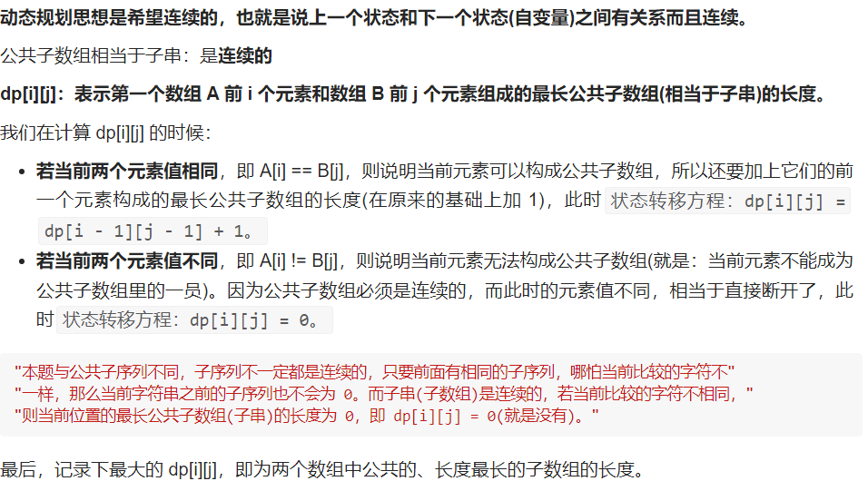
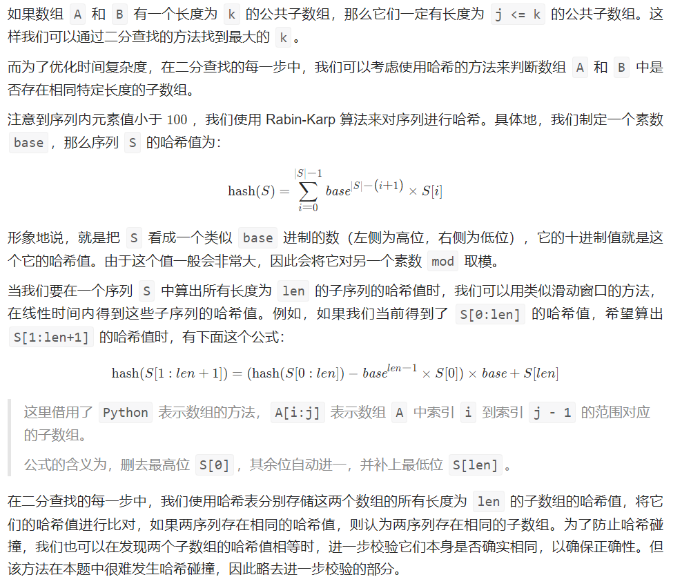

#### dp

#### 状态转移公式



```c++
class Solution {
public:
    int findLength(vector<int>& nums1, vector<int>& nums2) {
        int f[1010][1010] = {0};
        if (nums1[0] == nums2[0]) f[1][1] = 1;
        int len = 0;
        for (int i = 1; i <= nums1.size(); i ++ )
            for (int j = 1; j <= nums2.size(); j ++ )
            {
                if (nums1[i - 1] == nums2[j - 1]) 
                    f[i][j] = f[i - 1][j - 1] + 1;
                else 
                    f[i][j] = 0;
                len = max(len, f[i][j]);
            }

        return len;
    }
};
```

#### 时间复杂度：$$ O(mn) $$ 

#### 空间复杂度：$$ O(mn) $$


#### 滑动窗口

#### 我们可以枚举 A 和 B 所有的对齐方式。对齐的方式有两类：第一类为 A 不变，B 的首元素与 A 中的某个元素对齐；第二类为 B 不变，A 的首元素与 B 中的某个元素对齐。对于每一种对齐方式，我们计算它们相对位置相同的重复子数组即可

```c++
class Solution {
public:
    int maxLength(vector<int>& A, vector<int>& B, int addA, int addB, int len) {
        int ret = 0, k = 0;
        for (int i = 0; i < len; i++) {
            if (A[addA + i] == B[addB + i]) {
                k++;
            } else {
                k = 0;
            }
            ret = max(ret, k);
        }
        return ret;
    }
    int findLength(vector<int>& A, vector<int>& B) {
        int n = A.size(), m = B.size();
        int ret = 0;
        for (int i = 0; i < n; i++) {
            int len = min(m, n - i);
            int maxlen = maxLength(A, B, i, 0, len);
            ret = max(ret, maxlen);
        }
        for (int i = 0; i < m; i++) {
            int len = min(n, m - i);
            int maxlen = maxLength(A, B, 0, i, len);
            ret = max(ret, maxlen);
        }
        return ret;
    }
};
```

#### 时间复杂度：$$ O((m + n) * min(n, m)) $$ 

#### 空间复杂度：$$ O(1) $$


#### 二分查找 + 哈希



```c++
class Solution {
public:
    const int mod = 1000000009;
    const int base = 113;
    
    // 使用快速幂计算 x^n % mod 的值
    long long qPow(long long x, long long n) {
        long long ret = 1;
        while (n) {
            if (n & 1) {
                ret = ret * x % mod;
            }
            x = x * x % mod;
            n >>= 1;
        }
        return ret;
    }

    bool check(vector<int>& A, vector<int>& B, int len) {
        long long hashA = 0;
        for (int i = 0; i < len; i++) {
            hashA = (hashA * base + A[i]) % mod;
        }
        unordered_set<long long> bucketA;
        bucketA.insert(hashA);
        long long mult = qPow(base, len - 1);
        for (int i = len; i < A.size(); i++) {
            hashA = ((hashA - A[i - len] * mult % mod + mod) % mod * base + A[i]) % mod;
            bucketA.insert(hashA);
        }
        long long hashB = 0;
        for (int i = 0; i < len; i++) {
            hashB = (hashB * base + B[i]) % mod;
        }
        if (bucketA.count(hashB)) {
            return true;
        }
        for (int i = len; i < B.size(); i++) {
            hashB = ((hashB - B[i - len] * mult % mod + mod) % mod * base + B[i]) % mod;
            if (bucketA.count(hashB)) {
                return true;
            }
        }
        return false;
    }

    int findLength(vector<int>& A, vector<int>& B) {
        int left = 1, right = min(A.size(), B.size()) + 1;
        while (left < right) {
            int mid = (left + right) >> 1;
            if (check(A, B, mid)) {
                left = mid + 1;
            } else {
                right = mid;
            }
        }
        return left - 1;
    }
};
```

#### 时间复杂度：$$ O((m + n) * log(min(n, m)) $$ 

#### 空间复杂度：$$ O(n) $$