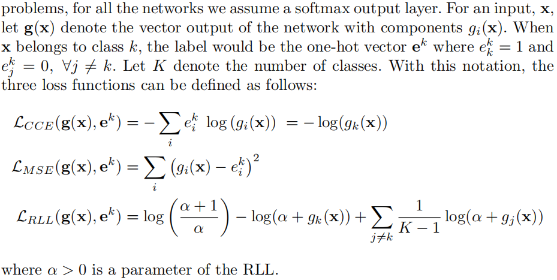
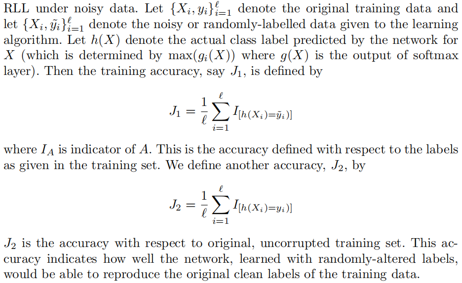

## 摘要

#### 深度神经网络经常过参数化，能够准确记忆甚至是随机标记的数据。实验研究表明没有标准正则化方法可以减少这种过拟合。我们研究了损失函数的选择是否会影响这种记忆。通过实验证明，在MNIST和CIFAR-10上，与交叉熵或平方误差损失相反，对称的损失函数可以显著提高网络抵抗这种过拟合的能力。我们提供了对记忆的鲁棒性的正式定义，并提供了为什么对称损失提供这种鲁棒性的理论解释。

## 引言

#### 标准的深度网络架构极易受到极端过拟合的影响。当随机改变训练数据中的标签时，这些网络可以几乎准确地学习随机标签。这种对训练例子的记忆不能通过任何标准的正则化技术来减轻。很多工作研究了这一现象。但是他们都没有关注于损失函数本身的作用。因此，我们通过实验证明损失函数在阻止网络记忆数据中发挥了重要作用。

#### 我们发现在随机标签的情况下，使用标准损失函数的网络表现出记忆能力。然后，我们将损失函数换成对称损失函数，在这里我们专门使用了RLL(robust log loss)，网络显著地抵抗了过拟合。使用这些对称损失函数的表现和在干净、真实数据上的表现更接近。在真实的数据中，网络试图适应数据中的模式，而不是记忆数据，而对于随机选择标签的数据，网络似乎在用蛮力记忆。这也证明损失函数在阻止记忆数据中扮演一个重要作用。

## 损失函数在抵抗记忆中的作用

#### 我们在两个网络结构上进行实验。Inception-Lite 和 ResNet-18

#### 使用三种损失函数：CCE、MSE 和 RLL

#### 在实验设置中，我们独立地以概率$$ (1 - \eta) $$保留原始标签，并以概率$$ \eta $$改变标签。当标签改变时，换成其他标签的概率是相等的。我们随机标签的概率$$ \eta \lt 0.9 $$，在理想情况下，预测正确的数据点会比被扰乱的数据点多。所以，当$ \eta $远低于0.9时，模型应该学习潜在的结构而不是过拟合到随机训练数据。

#### 从上面可以看出，模型学习到了一个可以准确复现原标签的函数。使用RLL的训练集精度在$ \eta $非零的情况下总是低于干净的数据。这说明网络并没有盲目地学习如何复制训练集的标签。在干净和有噪声的数据上，训练精度的差异几乎等于噪声率。这表明这个损失函数能够忽略错误标记的数据。

#### 这里我们定义了两个精度$$ J1 $$和$$ J2 $$

#### 可以看到RLL的$$ J2 $$没有出现跌落的情况，说明网络没有过拟合到随机标签上

## 对称损失函数的鲁棒性分析

#### 损失函数是对称的，那么随机翻转标签下的任何局部风险最小值也将是原始标签下的局部风险最小值。因为对称损失函数是有界的，所以给定一个有界的损失函数，我们可以通过正则化的方式使它满足对称条件。

## 结论

#### 损失函数的选择在深度网络的过拟合中起着关键作用。

